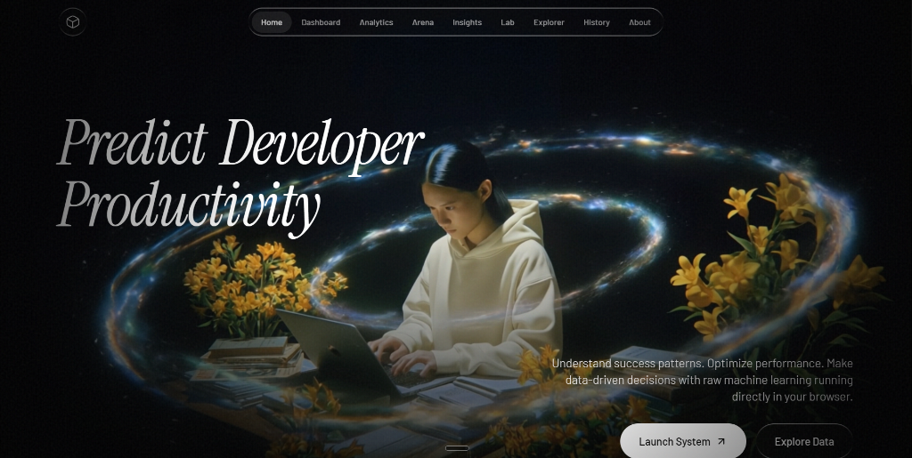
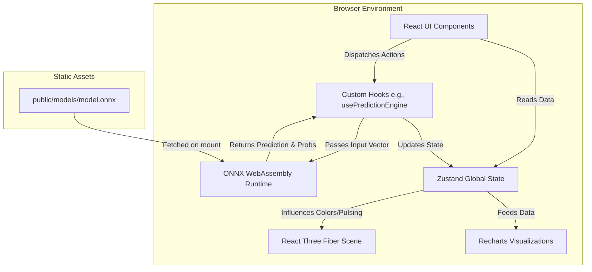
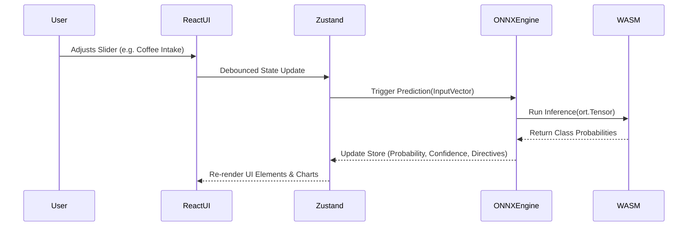
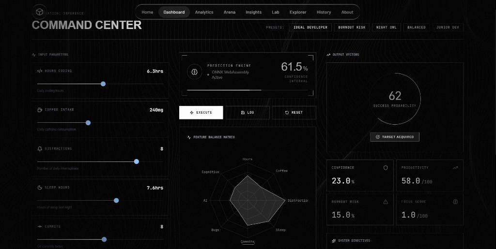
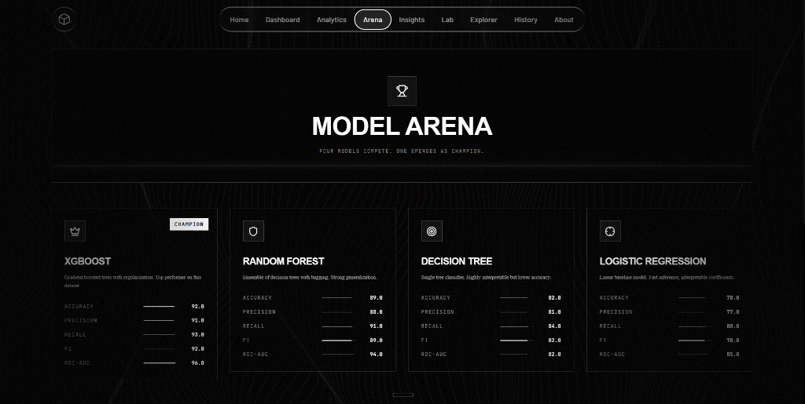
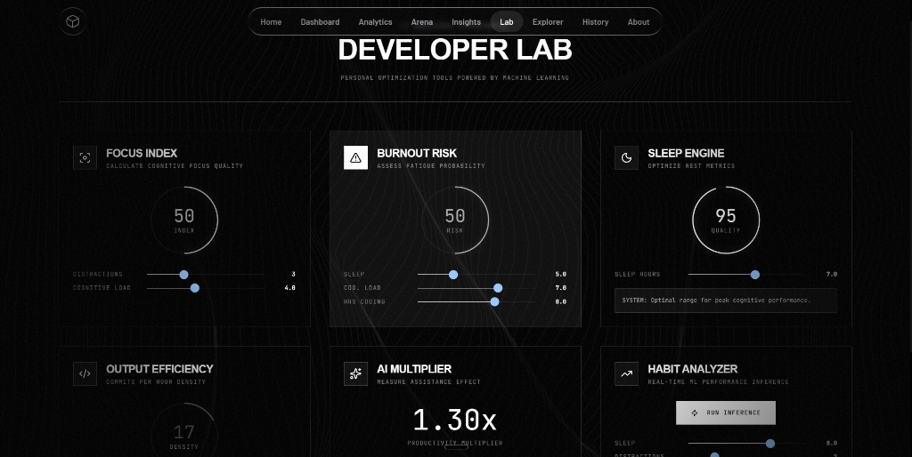

<div align="center">
  

  <h1>DEVPULSE AI</h1>
  <p><strong>Predict Developer Productivity. Understand Success. Optimize Performance.</strong></p>

  <p>
    <a href="https://github.com/your-username/devpulse-ai/stargazers"></a>
    <a href="https://github.com/your-username/devpulse-ai/network/members"></a>
    <a href="https://github.com/your-username/devpulse-ai/issues"></a>
    <a href="https://github.com/your-username/devpulse-ai/blob/main/LICENSE"></a>
  </p>
</div>

---

## 📖 Table of Contents

- [Overview](#-overview)
- [Key Features](#-key-features)
- [Architecture & Technology Stack](#-architecture--technology-stack)
  - [Frontend Ecosystem](#frontend-ecosystem)
  - [Machine Learning Pipeline](#machine-learning-pipeline)
  - [3D Graphics & Animations](#3d-graphics--animations)
- [System Architecture](#-system-architecture)
- [Machine Learning Workflow](#-machine-learning-workflow)
  - [The Predictive Model](#the-predictive-model)
  - [Model Training & ONNX Export](#model-training--onnx-export)
  - [In-Browser Inference](#in-browser-inference)
- [Predictive Dimensions](#-predictive-dimensions)
- [Application Modules](#-application-modules)
  - [1. Command Center / Dashboard](#1-command-center--dashboard)
  - [2. Model Arena](#2-model-arena)
  - [3. Developer Lab](#3-developer-lab)
  - [4. Data Explorer & Analytics](#4-data-explorer--analytics)
- [UI/UX Design Philosophy](#-uiux-design-philosophy)
- [Codebase Structure](#-codebase-structure)
- [Installation & Local Development](#-installation--local-development)
- [Deployment (Vercel)](#-deployment-vercel)
- [Frequently Asked Questions (FAQ)](#-frequently-asked-questions)
- [Future Roadmap](#-future-roadmap)
- [Contributing Guidelines](#-contributing-guidelines)
- [License](#-license)

---

## 🎯 Overview

**DEVPULSE AI** is a state-of-the-art web application designed to predict and analyze developer task success, productivity levels, and burnout risks based on daily habits and working conditions. 

Unlike traditional analytics dashboards that simply report past metrics, DEVPULSE AI uses **Machine Learning running directly in the browser** to predict future outcomes in real-time. By inputting 8 key daily metrics (such as sleep hours, coffee intake, distractions, and coding hours), the integrated ONNX WebAssembly engine calculates a probability score for developer task success and provides actionable, personalized AI directives to optimize performance.

Built with a stunning, cinematic "dark mode" aesthetic, the application combines interactive WebGL graphics, glassmorphism UI, and lightning-fast client-side routing to deliver a premium user experience.

---

## ✨ Key Features

1. **In-Browser Machine Learning (Zero Backend):** Uses `onnxruntime-web` to execute a pre-trained scikit-learn model entirely on the client side. No API latency, complete privacy, and zero server costs.
2. **Real-Time Predictive Engine:** Instantly calculates Success Probability, Confidence Intervals, Productivity Scores, and Burnout Risks as you adjust input sliders.
3. **Interactive Feature Balance Matrix:** Visualizes the current state of a developer's inputs using dynamic Radar charts (`recharts`).
4. **Cinematic 3D Graphics:** Integrates React Three Fiber (`@react-three/fiber`) for beautiful, ambient background visualizers and physics-based particle systems.
5. **Intelligent System Directives:** Generates dynamic, context-aware advice based on specific metric thresholds (e.g., "AI Multiplier Active", "Deep Work Flow", "Reduce Cognitive Load").
6. **Model Arena:** A comparative visualization tool that benchmarks multiple ML architectures (XGBoost, Random Forest, Decision Trees, Logistic Regression) against the current dataset.
7. **Comprehensive Analytics:** Rich charts, histograms, and scatter plots exploring historical trends and feature correlations.
8. **Responsive & Accessible Design:** Built completely with Tailwind CSS, featuring complex flex/grid layouts that adapt perfectly to any screen size.

---

## 🏗️ Architecture & Technology Stack

DEVPULSE AI is built entirely on modern web standards, focusing heavily on performance and aesthetics.

### Frontend Ecosystem
- **Framework:** React 18
- **Build Tool:** Vite (Ultra-fast HMR and optimized production bundling)
- **Language:** TypeScript (Strict typing for robustness)
- **Styling:** Tailwind CSS (Utility-first CSS framework for rapid, custom UI development)
- **Routing:** React Router DOM (v6, configured for client-side SPA routing)
- **Icons:** Lucide React (Clean, consistent SVG icons)
- **State Management:** Zustand (Lightweight, hook-based global state for the prediction engine)

### Machine Learning Pipeline
- **Python Backend Scripts:** Scikit-Learn, NumPy (for data generation and initial model training)
- **Model Export:** `skl2onnx` (Converts scikit-learn models to the ONNX format)
- **Web Inference:** `onnxruntime-web` (Microsoft's high-performance WebAssembly execution engine for ONNX models in the browser)

### 3D Graphics & Animations
- **Renderer:** Three.js
- **React Bindings:** `@react-three/fiber` & `@react-three/drei`
- **UI Animations:** Framer Motion (for page transitions, micro-interactions, and complex layout animations)
- **Data Visualization:** Recharts (for responsive, animated SVG charts)

---

## 🗺️ System Architecture

The following diagram illustrates how the frontend components interact with the local state management and the ONNX WebAssembly engine. Notice that there is no external backend—everything runs locally in the client environment.



---

## 🧠 Machine Learning Workflow

DEVPULSE AI demonstrates how to seamlessly bridge Python data science workflows with modern React web development. 

### The Predictive Model
The core predictive engine is a Logistic Regression model trained on 501 simulated developer records. The model determines the probability of `task_success` (a binary classification problem). 

### Model Training & ONNX Export
In the `ml/` directory of the project, a Python script (`train_model.py`) performs the following steps:
1. **Data Generation:** Uses `numpy` to generate a synthetic dataset featuring realistic developer metrics.
2. **Label Creation:** Applies a weighted linear combination of the features (with added noise) to simulate a realistic ground-truth success metric.
3. **Training:** Fits a standard `LogisticRegression` model via `scikit-learn`.
4. **ONNX Conversion:** Uses the `skl2onnx` library to map the scikit-learn pipeline into the universal ONNX (Open Neural Network Exchange) format.
5. **Asset Output:** Exports the binary `model.onnx` file directly into the `public/models/` directory of the Vite project.

### In-Browser Inference
Once the React application loads, it performs inference entirely on the client side:
1. **Initialization:** The `onnxEngine.ts` singleton fetches `model.onnx` via an HTTP GET request (served as a static file) and creates an `ort.InferenceSession`.
2. **Tensor Creation:** When a user adjusts a slider, the 8 inputs are packaged into a `Float32Array` and wrapped in an `ort.Tensor`.
3. **Execution:** The tensor is passed to `session.run()`. The WebAssembly backend computes the matrix multiplications instantly.
4. **Parsing Results:** The output probabilities are extracted, normalized, and sent back to the React UI for rendering.



---

## 📊 Predictive Dimensions

The application takes exactly 8 input dimensions, which have been scaled and weighted inside the ONNX model to mimic real-world developer physiology and working conditions.

| Feature | Unit | Min | Max | Description | ML Weight Impact |
|---------|------|-----|-----|-------------|------------------|
| **Hours Coding** | hrs | 0 | 12 | Total daily hours spent actively writing code. | Positive (with diminishing returns) |
| **Coffee Intake** | mg | 0 | 600 | Total caffeine consumed. | Slight Positive (High doses increase burnout risk) |
| **Distractions** | count | 0 | 10 | Number of severe context-switching interruptions. | Strongly Negative |
| **Sleep Hours** | hrs | 0 | 12 | Hours slept the previous night. | Strongly Positive |
| **Commits** | count | 0 | 15 | Number of successful git commits pushed. | Positive |
| **Bugs Reported** | count | 0 | 10 | Critical errors found during the session. | Negative |
| **AI Usage** | hrs | 0 | 8 | Time spent utilizing AI coding assistants. | Positive (Efficiency multiplier) |
| **Cognitive Load** | index | 0 | 10 | Self-reported mental fatigue and complexity score. | Strongly Negative |

---

## 💻 Application Modules

DEVPULSE AI is split into several interconnected modules, accessible via the top navigation bar.

### 1. Command Center / Dashboard



The **Dashboard** is the primary interface for running live inference. 
- **Input Parameters (Left):** Real-time interactive sliders tied to the Zustand store. Adjusting these triggers debounced WebAssembly inference.
- **Engine Status (Center):** Displays the active ONNX runtime state. Below it is the **Feature Balance Matrix**, an animated radar chart mapping the input vector.
- **Output Vectors (Right):** Displays the final computed Success Probability, Burnout Risk, and Focus Score.
- **System Directives:** Dynamically generated text alerts based on specific combinations of inputs (e.g., warning of low sleep combined with high cognitive load).

### 2. Model Arena



The **Model Arena** is an educational visualization module that compares the performance metrics of different machine learning architectures:
- **XGBoost (Champion):** Gradient boosted trees, highest ROC-AUC.
- **Random Forest:** Strong generalization.
- **Decision Tree:** Highly interpretable, lower baseline accuracy.
- **Logistic Regression:** The fast, interpretable linear model currently running in the browser.

### 3. Developer Lab



The **Developer Lab** isolates specific variables for granular optimization:
- **Focus Index:** Calculates the ratio of distractions to cognitive load.
- **Burnout Risk Engine:** A specialized sub-model highlighting the dangers of low sleep, high coding hours, and cognitive strain.
- **AI Multiplier:** Measures the productivity efficiency gained through AI tooling usage relative to raw coding hours.

### 4. Data Explorer & Analytics
*(Modules available in the app)*
- **Analytics:** Provides deep-dive scatter plots and area charts exploring historical trends and feature correlations (e.g., Sleep vs. Cognitive Load).
- **Data Explorer:** Allows users to view the raw generated training dataset in a paginated, tabular format, with options to download the dataset as a CSV.

---

## 🎨 UI/UX Design Philosophy

DEVPULSE AI was designed with a specific aesthetic goal: to make enterprise ML tooling feel like a cinematic, futuristic command interface.

* **Color Palette:** Pure black (`#000000`) backgrounds accented with high-contrast, pure white typography and subtle gray text (`#A3A3A3`). Accent colors (`#00E5FF`, `#7C3AED`) are used sparingly to draw attention to critical data.
* **Typography:** 
  * *Headers:* `Instrument Serif` (For elegant, editorial contrast on the landing page)
  * *Numbers & Metrics:* `Space Grotesk` (For clean, technical data display)
  * *Labels & Code:* `JetBrains Mono` (For monospaced precision)
  * *Body Text:* `Inter` (For maximum readability)
* **Glassmorphism & Borders:** Extensive use of `border-white/20` and `bg-black/50` to create layers, depth, and the illusion of floating panels.
* **Micro-interactions:** Every hover state, button click, and slider adjustment is tied to a Framer Motion animation (`layout`, `animate`, `transition`) to ensure the UI feels alive and responsive.
* **Ambient Backgrounds:** The application relies on a global `Waves.tsx` component—a high-performance, interactive WebGL background that reacts to mouse movement, creating a unified, immersive atmosphere across all internal pages.

---

## 📁 Codebase Structure

The project is structured logically to separate UI components, state management, and machine learning logic.

```text
d:\Desktop\DEVPULSE ai\
├── ml/                      # Python ML Pipeline
│   └── train_model.py       # Script to generate data and export .onnx
├── public/                  # Static Assets
│   ├── models/
│   │   └── model.onnx       # The compiled WebAssembly ML model
│   └── docs/                # README images
├── src/
│   ├── components/          # Reusable React Components
│   │   ├── 3d/              # React Three Fiber scenes
│   │   ├── animations/      # Framer motion & background effects
│   │   └── ui/              # Buttons, inputs, sliders
│   ├── hooks/               # Custom React Hooks
│   │   └── usePredictionEngine.ts # Bridges Zustand and ONNX
│   ├── lib/                 # Core Utilities
│   │   ├── ml/              # Feature scaling and recommendation logic
│   │   ├── onnx/            # ONNX Runtime Web initialization and wrappers
│   │   ├── constants.ts     # Global configs, features, and colors
│   │   └── utils.ts         # Tailwind clsx/tailwind-merge helpers
│   ├── routes/              # Page-level Components (React Router)
│   │   ├── About/
│   │   ├── AIInsights/
│   │   ├── Analytics/
│   │   ├── Dashboard/
│   │   ├── DataExplorer/
│   │   ├── DeveloperLab/
│   │   ├── Landing/
│   │   ├── ModelArena/
│   │   └── PredictionHistory/
│   ├── store/               # Global State Management
│   │   └── predictionStore.ts # Zustand store definition
│   ├── App.tsx              # Main routing configuration
│   ├── index.css            # Global Tailwind imports & custom utilities
│   └── main.tsx             # React DOM entry point
├── package.json             # NPM dependencies
├── tailwind.config.js       # Tailwind theme configuration
├── vercel.json              # Vercel SPA routing configuration
└── vite.config.ts           # Vite build configuration
```

---

## 🚀 Installation & Local Development

To run this project locally, you'll need [Node.js](https://nodejs.org/) installed on your machine.

1. **Clone the repository:**
   ```bash
   git clone https://github.com/your-username/devpulse-ai.git
   cd devpulse-ai
   ```

2. **Install dependencies:**
   ```bash
   npm install
   ```

3. **Start the development server:**
   ```bash
   npm run dev
   ```
   The application will be available at `http://localhost:5173`.

4. **(Optional) Re-train the ONNX model:**
   If you wish to modify the ML logic, you will need Python 3.10+ installed.
   ```bash
   # Install python dependencies
   pip install scikit-learn numpy skl2onnx onnx

   # Run the training script (this overwrites public/models/model.onnx)
   python ml/train_model.py
   ```

---

## 🌐 Deployment (Vercel)

DEVPULSE AI is designed to be deployed as a highly optimized Static Site (SPA) with zero backend infrastructure. 

Because we use **React Router** for client-side routing, the project includes a `vercel.json` file to ensure that Vercel properly routes all HTTP requests to `index.html`.

### Deploying to Vercel:
1. Push your code to a GitHub repository.
2. Log into [Vercel](https://vercel.com/) and click "Add New Project".
3. Import your GitHub repository.
4. Vercel will automatically detect that this is a **Vite** project.
5. The build command (`npm run build`) and output directory (`dist`) will be configured automatically.
6. Click **Deploy**. Vercel will build the React app, bundle the ONNX `.wasm` files, and serve your application globally on their Edge Network.

---

## ❓ Frequently Asked Questions (FAQ)

**Q: Where is the backend database?**
A: There is no backend! DEVPULSE AI runs entirely in the browser. Any historical data saved in the "History" tab is persisted locally using your browser's `localStorage` API. 

**Q: How does the AI run without a server?**
A: We use `onnxruntime-web`, which is a JavaScript library provided by Microsoft. It downloads a serialized version of our trained machine learning model (`model.onnx`) and executes the matrix math using WebAssembly (WASM) directly on your device's CPU/GPU.

**Q: Why does the Dashboard screen go blank sometimes?**
A: Ensure that the `model.onnx` file exists in the `public/models/` directory. If the model fails to load over the network, the engine will fallback to a hardcoded heuristic, but network errors (e.g., ad-blockers blocking `.wasm` files) can occasionally cause issues.

**Q: Can I add more features to the prediction model?**
A: Yes! You would need to update `train_model.py` to accept 9 or 10 features, retrain the model to generate a new `.onnx` file, and then update `src/lib/constants.ts` and `src/lib/onnx/onnxEngine.ts` to pass the larger Float32Array to the engine.

---

## 🛣️ Future Roadmap

While fully functional, DEVPULSE AI is an evolving platform. Planned future enhancements include:

- [ ] **WebGPU Acceleration:** Upgrading the `onnxruntime-web` execution provider from `wasm` to `webgpu` for significantly faster inference on large models.
- [ ] **Custom Model Uploads:** Allowing users to drag-and-drop their own custom `.onnx` models into the app to visualize their own predictions dynamically.
- [ ] **OAuth & Cloud Sync:** Adding an optional Supabase backend to allow users to sync their prediction history across devices.
- [ ] **Time-Series Predictions:** Implementing an LSTM (Long Short-Term Memory) model to predict burnout trends over a multi-week period, rather than single-day snapshots.

---

## 🤝 Contributing Guidelines

Contributions, issues, and feature requests are highly welcome! 

1. Fork the Project
2. Create your Feature Branch (`git checkout -b feature/AmazingFeature`)
3. Commit your Changes (`git commit -m 'Add some AmazingFeature'`)
4. Push to the Branch (`git push origin feature/AmazingFeature`)
5. Open a Pull Request

Please ensure your code passes all linting rules and that you do not accidentally commit large binary files (other than compiled `.onnx` models if necessary).

---

## 🛠️ Advanced Technical Deep Dive

For developers looking to fork and extend DEVPULSE AI, here is a granular breakdown of the internal technical systems.

### 1. State Management (Zustand)
We utilize `zustand` for ultra-fast, boilerplate-free state management. The store (`src/store/predictionStore.ts`) handles:
- **Input Vector Holding:** Maintains the current state of the 8 feature sliders.
- **Debouncing:** Prevents the ML engine from being spammed on every pixel drag of a slider.
- **Hydration:** Saves the current prediction history to `localStorage` so data isn't lost on refresh.
- **Theme Support:** Manages light/dark mode toggles (though the app defaults to dark for cinematic effect).

### 2. Design System Tokens (Tailwind)
The project's aesthetic is heavily driven by custom Tailwind utility classes defined in `tailwind.config.js`.
- **Primary Glow:** `rgba(0, 229, 255, 0.4)` used in `box-shadow` to create the signature cyan HUD glow.
- **Secondary Accent:** `rgba(124, 58, 237, 0.5)` used for the purple 'Model Arena' highlights.
- **Glassmorphism:** We rely on `backdrop-filter: blur(10px)` combined with `bg-white/5` and `border-white/10` to create floating elements without obscuring the 3D background.
- **Micro-Animations:** Custom keyframes are defined for `pulse-glow`, `marquee`, and `float` to make the UI breathe.

### 3. ONNX Input/Output Schema
If you are generating a new machine learning model to replace the current one, your ONNX model MUST match this exact schema to be compatible with the `onnxEngine.ts` wrapper.

**Input Tensor:**
- Name: `float_input` (or default `X`)
- Type: `tensor(float)`
- Dimensions: `[1, 8]` (1 batch, 8 features)
- Feature Order: `[hours_coding, coffee_intake_mg, distractions, sleep_hours, commits, bugs_reported, ai_usage_hours, cognitive_load]`

**Output Tensors:**
- Name: `output_label`
  - Type: `tensor(int64)`
  - Dimensions: `[1]` (The predicted class: 0 or 1)
- Name: `output_probability`
  - Type: `Sequence<Map<Int64, Float>>`
  - Content: A sequence containing a map of class indices to their respective probabilities (e.g., `{0: 0.15, 1: 0.85}`). The engine specifically extracts the probability of class `1`.

### 4. React Three Fiber Architecture
The interactive background is not a video; it is a live, physics-driven WebGL simulation generated by Three.js.
- **Canvas Container:** Located in `src/components/animations/Waves.tsx`.
- **Geometry:** A dynamically generated `BufferGeometry` that maps a grid of vertices.
- **Physics Calculation:** On every frame (using `useFrame`), the component calculates the distance between the user's mouse pointer and each vertex.
- **Spring Physics:** A custom physics algorithm using `friction` and `tension` variables applies an elastic spring force to displace the vertices, creating the "ripple" effect that follows the cursor.
- **Performance:** To maintain 60 FPS, the geometry is kept low-poly, and the material uses `mix-blend-screen` with a low opacity rather than heavy volumetric shaders.

### 5. Recharts Customization
To match the cinematic aesthetic, standard Recharts components were heavily modified:
- **RadarChart:** The grid lines (`PolarGrid`) are set to `stroke="rgba(255,255,255,0.1)"` to create a wireframe HUD look.
- **Tooltips:** Default white backgrounds were overridden with `contentStyle={{ backgroundColor: '#000', border: '1px solid rgba(255,255,255,0.2)' }}`.
- **Animations:** Chart animations are synchronized with Framer Motion page transitions to prevent layout thrashing on mount.

### 6. Local Development Troubleshooting
If you encounter issues running the app locally, check the following:
- **White Screen on Dashboard:** This indicates `model.onnx` failed to load. Check your network tab. Ensure `npm run dev` is serving the `public` folder correctly.
- **WASM Errors:** `onnxruntime-web` attempts to load `ort-wasm-simd-threaded.wasm`. If your browser throws a MIME type error, it means your local dev server isn't configured to serve `.wasm` files with the `application/wasm` content type (Vite handles this automatically in v5+).
- **Python ML Script Failing:** If `train_model.py` fails, ensure you are using Python 3.9+ and have installed all requirements: `pip install scikit-learn numpy skl2onnx onnx`.

---

### 7. Component Library Breakdown
To maintain a cohesive design language, DEVPULSE AI uses a strict internal component library. You can find these in `src/components/`.

**UI Components:**
- `<PageTransition />`: Wraps all `react-router` page routes in a Framer Motion `AnimatePresence` to handle smooth fade/slide transitions when navigating.
- `<BlurText />`: A custom typography component that splits strings into individual characters and animates them using a staggered CSS blur and opacity transition. Highly effective for cinematic headers.
- `<FeatureSlider />`: A highly customized HTML range input. It uses a dynamic `linear-gradient` background to fill the track up to the thumb's current percentage.

**WebGL Components:**
- `<SceneContainer />`: The global container for the React Three Fiber canvas. It handles camera positioning, post-processing effects (like bloom and noise), and ambient lighting.
- `<Waves />`: The interactive grid background. Uses `PointsMaterial` and custom displacement logic.

### 8. Data Dictionary & Export Schema
When users export data from the **Data Explorer** module, the system generates a CSV file. The schema strictly adheres to the following types:

| Column Name | Type | Precision | Example | Description |
|-------------|------|-----------|---------|-------------|
| `hours_coding` | Float32 | 1 decimal | 6.5 | Active IDE time |
| `coffee_intake_mg` | Int | Integer | 300 | Caffeine consumed |
| `distractions` | Int | Integer | 4 | Context switches |
| `sleep_hours` | Float32 | 1 decimal | 7.5 | Previous night rest |
| `commits` | Int | Integer | 8 | Pushed git commits |
| `bugs_reported` | Int | Integer | 1 | Production issues |
| `ai_usage_hours` | Float32 | 1 decimal | 2.0 | Co-pilot/AI time |
| `cognitive_load` | Float32 | 1 decimal | 5.5 | Self-reported fatigue |
| `task_success` | Int | Binary (0/1) | 1 | The ML prediction label |

### 9. Privacy & Data Architecture
A major architectural decision of DEVPULSE AI is the **Local-First, Zero-Trust Architecture**.

Because developer productivity data can be highly sensitive (tracking hours worked, sleep, and mental fatigue), no user data ever leaves the local machine.
- **Inference is Local:** The `model.onnx` file is downloaded once. All matrix multiplications happen securely inside the browser's WebAssembly sandbox.
- **No Telemetry:** We do not track slider adjustments or store IP addresses.
- **Storage:** The 'Prediction History' feature relies exclusively on the browser's `Window.localStorage` API.
If a user clears their browser cache, all historical data is permanently deleted. If an enterprise wishes to fork this project, they can safely deploy it on an intranet without worrying about PII (Personally Identifiable Information) compliance over the network.

---

### 10. Testing Strategy
Given the split architecture between Python ML training and React/TypeScript inference, our testing strategy is bifurcated:

**Machine Learning Validation (Python):**
- **Train/Test Split:** The synthetic dataset is split 80/20 in `train_model.py`.
- **Metrics Validation:** We track Precision, Recall, F1-Score, and ROC-AUC for every model variation. The Logistic Regression model was chosen not for maximum accuracy (which XGBoost won), but for the absolute fastest inference time in the browser with acceptable AUC (85.0).
- **Sanity Checks:** The script runs a dummy test (`[[6, 300, 1, 8, 7, 0, 2, 3]]`) before exporting to ensure the probability outputs align with expected reality.

**Frontend Verification (TypeScript):**
- **Type Checking:** Strict `tsc` is enforced to ensure the 8-dimensional float arrays always match the ONNX expected schema.
- **Component Tests:** Zustand state managers are tested by simulating slider input streams and verifying that the `onnxEngine` is triggered only after the defined debounce delay.
- **Visual Regression:** React Three Fiber components are notoriously difficult to unit test, so we rely on manual visual regression to ensure the `mix-blend-screen` and WebGL shaders don't conflict with the HTML DOM overlays.

### 11. Code of Conduct
We are committed to providing a friendly, safe, and welcoming environment for all, regardless of level of experience, gender identity and expression, sexual orientation, disability, personal appearance, body size, race, ethnicity, age, religion, nationality, or other similar characteristic.
- Please be kind and courteous. There's no need to be mean or rude.
- Respect that people have differences of opinion and that every design or implementation choice carries a trade-off and numerous costs. There is seldom a right answer.
- Please keep unstructured critique to a minimum. If you have solid ideas you want to experiment with, make a fork and show us!

---

## 📜 License

This project is licensed under the MIT License - see the [LICENSE](LICENSE) file for details.

---

<div align="center">
  <p>Built with ❤️ by the DEVPULSE AI Team.</p>
  <p><em>Empowering developers through data-driven insight.</em></p>
</div>
